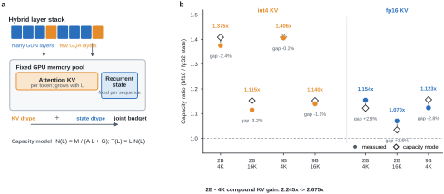

# Precision Accounting for Hybrid LLM Serving

Research artifact for **Precision Accounting for KV and Recurrent-State
Caches in Hybrid LLM Serving**. The project studies how attention KV precision
and recurrent-state precision share one vLLM cache budget in hybrid
linear-attention models.

> Status: private, unpublished research. The manuscript is anonymous and the
> repository intentionally does not provide public citation or license terms
> yet.

[MLSys manuscript](paper/mlsys2026/main.pdf) |
[IEEE/DLS manuscript](paper/dls2026/main.pdf) |
[Artifact guide](docs/artifact.md) |
[Environment](docs/environment.md) |
[Canonical results](results/README.md)



## What this repository establishes

Hybrid models allocate two caches with different scaling laws:

\[
C(L) = \frac{L M}{A L + G},
\]

where \(A\) is attention-KV bytes per token, \(G\) is recurrent-state bytes
per sequence, \(M\) is the cache budget, and \(L\) is context length. The
repository connects this continuous accounting model to vLLM's discrete block
and page allocation, then audits quality, serving stability, and a fail-closed
offline selector.

This is an allocator-characterization study. It does **not** introduce a new
quantizer, cache allocator, or online scheduler, and it does not claim a
workload-general end-to-end serving gain.

| Evidence | Supported result | Canonical artifact |
|---|---|---|
| Allocator matrix | bf16 recurrent state increases token capacity in all 52 paired cells; median gain 15.44% | [`capacity-phase-formal-corrected.analysis.json`](results/verified/2026-08-14/capacity-phase-formal-corrected.analysis.json) |
| Accounting model | median absolute residual 2.38%; signed residuals -5.16% to +13.21%, so the model is neither a lower nor an upper bound | [`capacity-2x2-analysis-corrected.json`](results/verified/2026-08-14/capacity-2x2-analysis-corrected.json) |
| GSM8K quality | state-only change -1.00 point, 95% CI [-2.04, +0.04]; int4-KV change -2.72 points, [-5.28, -0.17] | [`gsm8k-state9seed-v2-dependence-aware-20260814.json`](results/quality/gsm8k-state9seed-v2-dependence-aware-20260814.json) |
| Offline selector | the strict request selects full precision; medium, high, and negative-control requests have no feasible candidate | [`selector-audit.json`](results/verified/2026-08-14/controller-decisions/selector-audit.json) |
| Serving stability | the four-configuration temporal audit fails its primary gate: 183/720 continuous-goodput comparisons exceed 10% tolerance | [`m4_formal_analysis.json`](results/reproduction/2026-08-13/m4-four-config/analysis-r3/m4_formal_analysis.json) |

## Quick verification

Use Linux or WSL2 with Python 3.10-3.12. Native Windows vLLM execution and
Python 3.13 are outside the supported environment.

```bash
git clone --depth 1 <private-repository-url>
cd hybrid-cache-precision
python3.12 -m venv .venv
source .venv/bin/activate
python -m pip install --upgrade pip
python -m pip install -e ".[analysis,dev]"
./reproduce.sh verify
```

The verification command runs the unit tests and independently checks 16
source hashes, eight vector-figure pairs, the corrected capacity source, and
the two-way clustered GSM8K analysis. It does not require a GPU or download
model weights.

To regenerate the committed paper figures from the frozen aggregate evidence:

```bash
./reproduce.sh figures
```

Full GPU reproduction requires a 32 GB RTX 5090 environment, Qwen3.5 model
weights, licensed datasets, and the pinned vLLM patch stack. See
[`docs/artifact.md`](docs/artifact.md) before running it.

## Repository map

| Path | Purpose |
|---|---|
| `src/kvcache/` | Core quantization, cache, calibration, and selector code |
| `configs/` | Frozen model, dataset, precision, benchmark, and experiment contracts |
| `scripts/` | Experiment launchers, analyzers, controller tools, and figure builders |
| `tests/` | Unit and contract tests for the research code |
| `results/quality/` | Aggregated quality analyses |
| `results/verified/` | Hash-addressed validation and reproduction evidence |
| `results/reproduction/` | Temporal reruns and audit reports |
| `paper/mlsys2026/` | Anonymous MLSys-format manuscript and editable figure sources |
| `paper/dls2026/` | IEEE MASS DLS workshop version of the same study |
| `vendor/vllm-patches/` | Reconstructable two-commit vLLM patch stack |
| `data/MANIFEST.yaml` | Dataset provenance, licenses, revisions, and checksums |

Raw model weights, datasets, local virtual environments, downloaded vLLM
sources, and large server archives are intentionally excluded. Aggregate
evidence and its checksums remain in Git.

## Paper and release status

The two paper directories are venue-specific versions of the same research,
not separate projects. Citation metadata will be added after the author list,
venue, and archival identifier are final. No public license is granted by this
private repository; third-party files retain their original terms.
